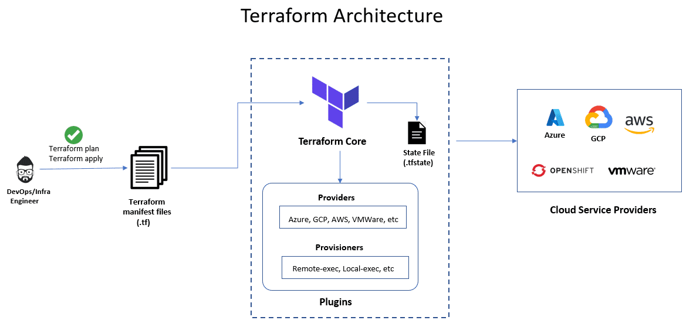

# Day 3

## Info - Terraform Overview
<pre>
- is one of the Infrastructure as a code tool (Iac)
- it is cloud newtral, hence this Iac tool can be used in any public cloud environment like AWS, Azure, GCE, etc.,
- this also called used to provision infrastructure on your on-prem data-centres
- it helps you provision containers, manage images, provision virtual machines locally or on public cloud, etc.,
- it can be used provision storage cluster, etc.,
- it can be used to provision eks, aks, ROSA, ARO on public cloud
- unlike the AWS cloudformation,  Terraform works on any environment and any cloud
- it comes in 2 flavours
  1. Terraform core ( command-line only - opensource and free )
  2. Terraform Enterprise ( Web console and it is a paid tool )
</pre>

## Info - Terraform High Level Architecture


## Lab - Checking the Terraform version
```
terraform --version
```


## Info - Terraform Providers
<pre>
- Terraform depends on Providers to provision resources
- For example
  - In order to provision an ec2 instance in AWS, Terraform depends on a provider called AWS ( registry.terraform.io )
  - IN order to provision an azure VM in Azure portal, Terraform depends on a provider called Azure
  - as long as there is a provider, Terraform can provision resources on that environment
  - In case, to provision a particular type of resource within your organization and there is no read-made provider, you can
    develop your own provider in Golang using Terraform Provider SDK
  - Providers supports two types of objects/resources
    1. Resources
       - If you wish to Provision ec2 instances using Terraform, then you will define a resource block expressing your expected state
       - Terrafrom can Create, Replace, Update and Delete the resources managed by Terraform
    2. DataSources ( already existing resources - these objects will be treated by Terraform as a read-only resource )
       - these resources are not managed by Terraform
       - they are managed outside Terraform
       - Terraform can refer and use it the HCL (Hashicorp Configuration Language - Terraform's proprietary language )
       - IN case to provision certain resource you declarative terraform script(manifest) file depends on already existing resource
         then, we call them as DataSources or Data block
</pre>

## Info - Terraform Resources
<pre>
- Each Terraform Provider supports one to many Resources and one to many Datasources
- For instance, the docker provider supports the following resources
  - docker_image
  - docker_container
</pre>

## Lab - Downloading docker image using Terraform
Create a file named main.tf with the below code
<pre>
terraform {
  required_providers {
    docker = {
      source = "kreuzwerker/docker"
      version = "3.6.2"
    }
  }
}

provider "docker" {
  # Configuration options
}

resource "docker_image" "nginx_docker_image" {
    name = "bitnami/nginx:latest"
}  
</pre>

Then let's download the docker provider using the below command
```
terraform init
tree .terraform
terraform plan
terraform apply
cat terraform.tfsate
```


## Lab - Provisioning container using Terraform

Create a separate folder for each exercise
```
cd ~
mkdir provision-docker-containers
cd provision-docker-containers
touch providers.tf main.tf
tree
```

Create a file named providers.tf with the below code
<pre>
terraform {
  required_providers {
    docker = {
      source = "kreuzwerker/docker"
      version = "3.6.2"
    }
  }
}

provider "docker" {
  # Configuration options
} 
</pre>

Create a file named main.tf with the below code
<pre>
data "docker_image" "bitnami_nginx_image" {
   name = "bitnami/nginx:latest"
}

resource "docker_container" "my_nginx1_container" {
   name = "nginx_container_1"
   image = data.docker_image.bitnami_nginx_image.name
}

resource "docker_container" "my_nginx2_container" {
   name = "nginx_container_2"
   image = data.docker_image.bitnami_nginx_image.name
}  
</pre>

You may download the providers and do the terraform provisioning
```
terraform init
terraform plan
terraform apply --auto-approve
terraform show
docker images  | grep nginx
docker ps
```

## Lab - Importing existing resources into Terraform
First of all, we need ensure the bitnami/nginx:latest image is available in your local docker registry
```
docker images | grep nginx
```

Then, ensure the nginx1, nginx2 and nginx3 containers are created
```
docker run -d --name nginx1 --hostname nginx1 bitnami/nginx:latest
docker run -d --name nginx2 --hostname nginx2 bitnami/nginx:latest
docker run -d --name nginx3 --hostname nginx3 bitnami/nginx:latest
docker ps
```

Create a folder 
```
cd ~
mkdir -p terraform-import-already-provisioned-resources
cd terraform-import-already-provisioned-resources
```

Create a file named main.tf with the below code
<pre>
terraform {
  required_providers {
    docker = {
      source = "kreuzwerker/docker"
      version = "3.6.2"
    }
  }
}

provider "docker" {
  # Configuration options
} 

resource "docker_container" "nginx_container_1" {
}

resource "docker_container" "nginx_container_2" {
}


resource "docker_container" "nginx_container_3" {
}
</pre>

Then find the container id of nginx1
```
docker ps
docker inspect nginx1
```

Import the nginx1 meta-data into terraform empty resource block
```
terraform import resource.docker_container.nginx_container_1 db5f7f1b10bce6bb630960d82b0c5d6b83c9d7a5d9dcb413ca3718d54af7c4ae
```

Then find the container id of nginx2
```
docker ps
docker inspect nginx2
```

Import the nginx2 meta-data into terraform empty resource block
```
terraform import resource.docker_container.nginx_container_2 ecdbe2a586b043a8cb81b41810f43475cde6a7d2b5ff5f0cc7f41857db69f4f6
```

Then find the container id of nginx2
```
docker ps
docker inspect nginx3
```

Import the nginx3 meta-data into terraform empty resource block
```
terraform init
terraform import resource.docker_container.nginx_container_3 01f946755114bdf55786f0a1bcf573a1c43ec81cb808232daccbb976382ac201
```

Now you can the terraform state file
```
cat terraform.tfstate
```

Based on the terraform state file, you can fill up the main.tf mandatory fields for resource.docker_container.nginx_container_1, resource.docker_container.nginx_container_2 and resource.docker_container.nginx_container_3.

Moving forward, you can now manage nginx1, nginx2 and nginx3 using the terraform manifest scripts.


Once you are done with this exercise, you may dispose the resources managed by terraform.
```
terraform destroy --auto-approve
docker images | grep nginx
docker ps -a
```

## Lab - Terraform Input and output variables

Create a folder
```
mkdir -p ~/terraform-input-and-output-variables
cd ~/terraform-input-and-output-variables
```

Create a file named inputs.tf with the below code
<pre>
variable "container_name1" {
   description = "Name of the container"
   type = string
   default = "ubuntu_c1"
}

variable "container_name2" {
   description = "Name of the container"
   type = string
   default = "rocky_c1"
}
  
</pre>

Create a file named outputs.tf with the below code
<pre>
output "container1_id" {
  value = docker_container.my_ubuntu_container1.id
}

output "container2_id" {
  value = docker_container.my_rocky_container1.id
}

output "container_name1" {
   value = docker_container.my_ubuntu_container1.name
}

output "container_name2" {
   value = docker_container.my_rocky_container1.name
}

output "container1_ip" {
   value = docker_container.my_ubuntu_container1.network_data[0].ip_address
}
output "container2_ip" {
   value = docker_container.my_rocky_container1.network_data[0].ip_address
}  
</pre>

Create a file named main.tf with the below code
<pre>
data "docker_image" "tektutor_ansible_ubuntu_image" {
  name = "tektutor/ubuntu-ansible-node:latest"
}

data "docker_image" "tektutor_ansible_rocky_image" {
  name = "tektutor/rocky-ansible-node:latest"
}

resource "docker_container" "my_ubuntu_container1" {
  image = data.docker_image.tektutor_ansible_ubuntu_image.name
  name =  var.container_name1
}

resource "docker_container" "my_rocky_container1" {
  image = data.docker_image.tektutor_ansible_rocky_image.name
  name =  var.container_name2
}  
</pre>

Create a file named providers.tf with the below code
<pre>
terraform {
  required_providers {
    docker = {
      source = "kreuzwerker/docker"
      version = "3.6.2"
    }
  }
}

provider "docker" {
  # Configuration options
}   
</pre>

Now you can run the below commands
```
terraform init
terraform plan
terraform apply --auto-approve
terraform show
```


Once you are done with this exercise, you can dispose the resources as shown below
```
cd ~/terraform-input-and-output-variables
terrform destroy --auto-approve
```


## Lab - Invoking ansible-playbooking using terraform local-exec provisioner block
```
mkdir ~/terraform-local-exec-provisioner
cd ~/terraform-local-exec-provisioner
ls -l
cat ansible.cfg
cat dynamic_inventory.py
cat inputs.tf
cat outpus.tf
cat main.tf
cat providers.tf
docker images | grep nginx
docker ps -a

terraform init
terraform plan
terraform apply --auto-approve
terraform show
docker images | grep nginx
docker ps -a

curl http://localhost:8001
curl http://localhost:8002
```


